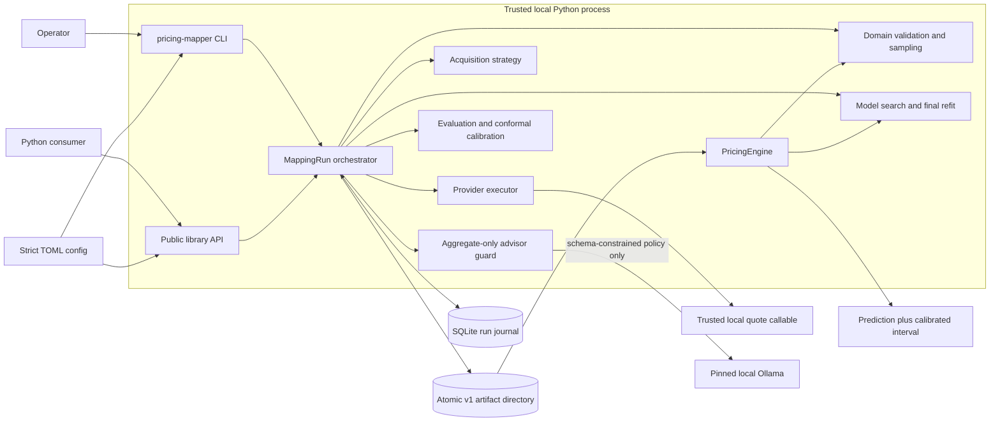
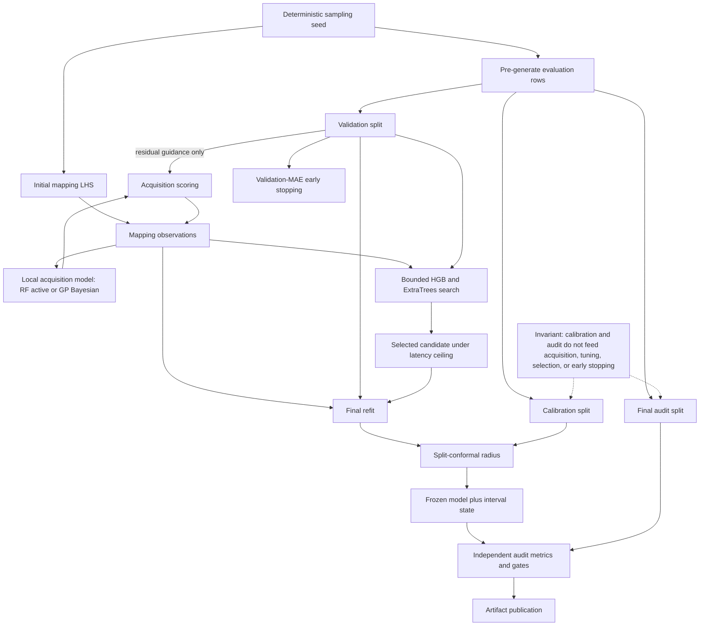
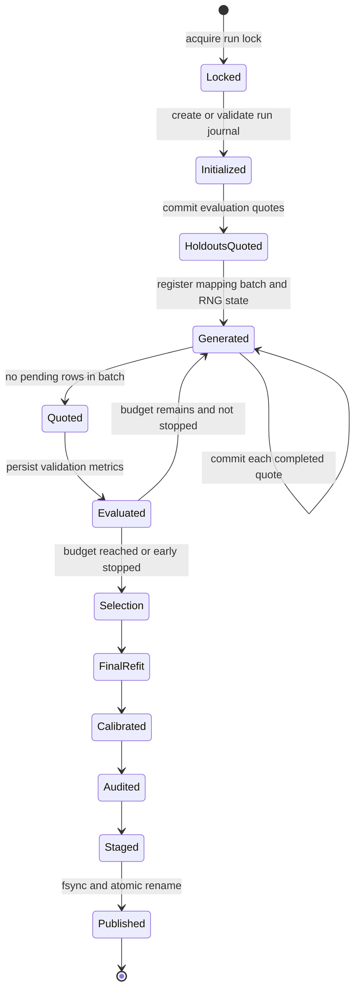
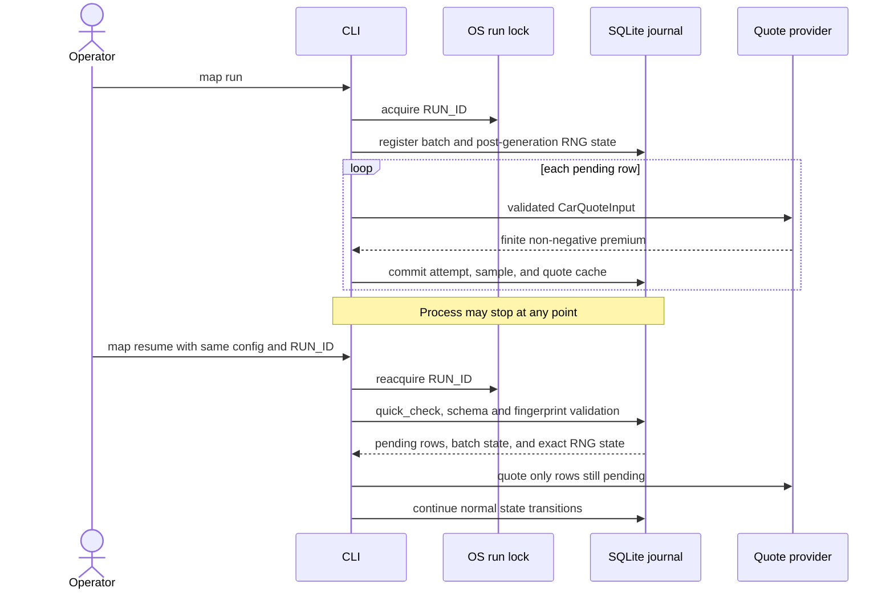

# Architecture

Pricing Function Mapper v1 is an offline Python library and CLI. It learns a
surrogate from a trusted local quote callable, persists crash-safe run state,
and publishes an immutable artifact directory for offline inference.

The architecture is built around four invariants:

1. public inputs are strictly validated and never clipped;
2. calibration and audit targets cannot influence acquisition or model
   selection;
3. every completed provider quote is transactionally durable;
4. an artifact becomes visible only after it is complete, synced, and renamed
   atomically.

For command-by-command procedures, see the
[operational playbooks](operations.md).

## System context



The provider is trusted code and runs with the caller's permissions. There is
no network service or sandbox in v1. The only intended writes are the selected
output tree, benchmark output, and explicit CLI output paths.

## Component responsibilities

| Module | Responsibility | Durable output |
|---|---|---|
| `domain` | strict 15-field input, v1 bounds, internal sampling | domain/schema snapshots |
| `config` | nested TOML validation, defaults, fingerprint | `config.toml` |
| `provider` | callable resolution, I/O checks, retries, telemetry | attempts and quote cache |
| `persistence` | transactions, samples, RNG state, batches, run lock | `run.sqlite3` |
| `acquisition` | uncertainty, residual, breakpoint, diversity scoring | selected mapping rows |
| `advisor` | aggregate diagnostics, strict policy schema, pinned Ollama client | decision provenance |
| `models` | RF active committee, Bayesian GP, HGB/ExtraTrees search, latency selection | fitted estimator |
| `evaluation` | metrics, bootstrap bounds, slices, conformal intervals | evaluation metadata |
| `orchestration` | new/resumed run state machine and leakage boundaries | completed run state |
| `artifact` | staging export, hashes, `skops` checks, compatibility | artifact directory |
| `engine` | strict offline prediction and intervals | predictions |
| `cli` | subcommands, file adapters, stable exit codes | requested output files |

## Training and holdout boundaries

All evaluation feature rows are generated before adaptive mapping begins.
They are quoted and assigned to immutable splits. Validation may guide
residual acquisition, early stopping, and candidate selection. Calibration
and audit remain isolated.



The final estimator is fit on mapping plus validation rows. Calibration
residuals determine only the conformal radius. Audit rows determine only final
metrics, interval coverage, warnings, and promotion eligibility. Audit results
must never be used to tune and republish the same candidate.

## Run and batch lifecycle

The output tree for run `RUN_ID` is:

```text
outputs/
├── .locks/RUN_ID.lock
├── .runs/RUN_ID/run.sqlite3
└── RUN_ID/                    final immutable artifact
```

The lock file may remain after a process exits; ownership is held by the OS
advisory lock, not by file existence.



SQLite batch states are `generated`, `quoted`, and `evaluated`. Sample states
are `pending` and `complete`. A premium and its provider-specific quote-cache
entry are committed in the same transaction.

For Bayesian hybrid runs, the Gaussian process and all candidate scores remain
inside Python. Before a post-initialization batch, Ollama sees only binned,
normalized counts/statistics and score distributions. The accepted finite
policy, prompt/request/response hashes, runtime/model pins, generation options,
and timing commit in the same SQLite transaction as the selected rows. If all
three attempts fail validation or transport, no batch is registered and no
provider quote is consumed. Resume reuses a registered decision and batch.

## Crash recovery sequence



Recovery behavior by interruption point:

| Interruption | Resume behavior |
|---|---|
| before batch registration | generation repeats from the preceding RNG state |
| after batch registration | the exact registered rows are reused |
| during quote execution | completed rows come from SQLite/cache; pending rows are called |
| after quote completion | the quoted batch is evaluated deterministically |
| during artifact staging | no final directory is exposed; staging is cleaned |
| after publication | resume validates and returns the existing artifact |

Resume intentionally fails if configuration, domain, provider identity, run
schema, Python version, or numerical/model dependency versions differ.

## Artifact publication and trust boundary

```mermaid
flowchart LR
    subgraph TrustedBuild["Trusted build boundary"]
        State[("Validated SQLite state")] --> Export["Artifact exporter"]
        Estimator["Fitted sklearn estimator"] --> Export
        Export --> Staging["Private staging directory"]
        Staging --> Hashes["SHA-256 manifest and schema checks"]
        Hashes --> Sync["fsync files and directory"]
        Sync --> Rename["Atomic rename"]
    end

    Rename --> Artifact[("Immutable artifact directory")]
    Artifact --> Transport["Storage or transport"]
    Signing["External signing and access control"] -.->|authenticity| Transport
    Transport --> Loader["Artifact validator"]

    subgraph TrustedLoad["Trusted load boundary"]
        Loader --> Layout["Exact file set and no symlinks"]
        Layout --> Integrity["Sizes and SHA-256 hashes"]
        Integrity --> Semantics["JSON, TOML, CSV, domain, and gate semantics"]
        Semantics --> Compatibility["Exact sklearn/runtime compatibility"]
        Compatibility --> Skops["Fixed skops type allow-list"]
        Skops --> Engine["PricingEngine"]
    end
```



Manifest hashes detect accidental corruption and partial transfer. They do not
authenticate an artifact if an attacker can replace both the files and the
manifest. Authenticity requires external signing, trusted storage, and access
control.

The artifact contains one fitted sklearn estimator in `model.skops`.
Validation, domain behavior, model-family selection, encoding decisions,
conformal state, and prediction behavior are reconstructed from code plus
versioned JSON/TOML metadata. Pickle is never loaded.

## Determinism and concurrency

- Evaluation and mapping use separate deterministic RNG streams.
- A mapping batch and the RNG state after its generation are one transaction.
- Model identities exclude paths and wall-clock latency.
- Runtime dependency versions are part of run compatibility and model
  identity.
- Histogram-gradient-boosting fit and warm single-row inference use one
  OpenMP thread.
- Provider execution is sequential by default. Parallel execution requires
  explicit `thread_safe = True` and a declared maximum concurrency.
- Ollama output is untrusted even when JSON Schema constrained. Unknown fields,
  duplicate keys, non-finite values, unknown policies/bins, invalid boosts,
  oversized responses, and model-digest mismatches fail closed.
- One OS advisory lock serializes work for a run ID. Different run IDs may run
  concurrently if provider and machine capacity permit.

## Security and data handling

The SQLite journal and exported `dataset.csv` contain sampled quote inputs and
premiums. Treat both as sensitive when a real provider is used. Provider
telemetry and logs use row hashes and exception types rather than payloads or
provider exception messages.

See [SECURITY.md](../SECURITY.md) for the trust model and
[regulatory-limitations.md](regulatory-limitations.md) for product constraints.
