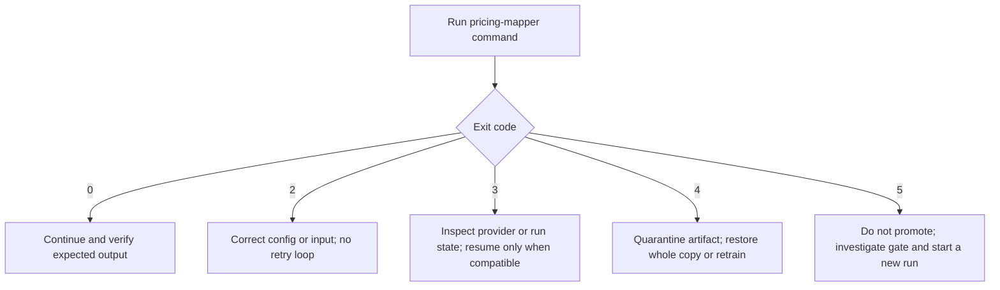
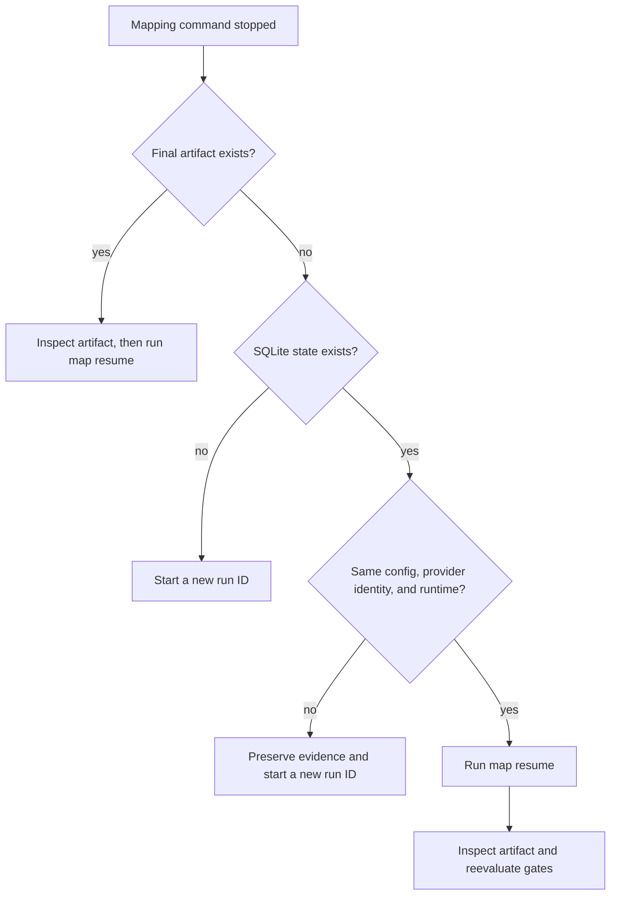
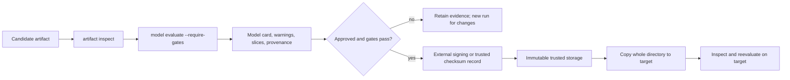

# Operational playbooks

These playbooks cover routine operation and recovery for the offline v1
library and CLI. They assume a trusted local provider, an isolated Python
environment, and an output tree on a filesystem that supports SQLite locking
and atomic directory rename.

They do not turn a passing model into an approved insurance product. Apply the
governance controls in [regulatory-limitations.md](regulatory-limitations.md)
before any real use.

## Operating invariants

Keep these rules true during every procedure:

- Treat the run configuration, provider identity, Python version, and
  numerical/model dependencies as immutable after a run starts.
- Never edit `run.sqlite3`, regenerate artifact hashes, add files inside an
  artifact, or bypass a live run lock.
- Do not tune a candidate from audit results. A changed policy requires a new
  run ID and a fresh independent audit.
- Move and retain an artifact as one complete directory.
- Keep evidence such as reevaluation reports outside the artifact directory;
  unlisted artifact files are rejected.
- Protect the SQLite journal and `dataset.csv` as sensitive when a real
  provider is used.
- Preserve the exact runtime for any deployed artifact. Cross-version sklearn
  loading is rejected.
- For hybrid experiments, preserve the exact Ollama image, model digest, and
  accepted decisions. Never edit or regenerate advisor journal records.

## Paths and naming

The examples use task-specific shell variables:

```bash
CONFIG_PATH=config.production.toml
RUN_ID=car-map-20260729-01
OUTPUT_ROOT=outputs
ARTIFACT_DIR="$OUTPUT_ROOT/$RUN_ID"
STATE_DB="$OUTPUT_ROOT/.runs/$RUN_ID/run.sqlite3"
EVIDENCE_DIR="run-evidence/$RUN_ID"
mkdir -p "$EVIDENCE_DIR"
```

Use a unique, immutable run ID that can be tied to an internal change record.
Do not reuse an ID after a failed or rejected experiment.

## Exit-code routing



| Code | Meaning | First response |
|---|---|---|
| `0` | command succeeded | verify the emitted path/report |
| `2` | invalid input or configuration | correct and revalidate the input |
| `3` | provider, persistence, or run failure | preserve state and follow the resume/provider playbook |
| `4` | unsafe, corrupt, or incompatible artifact | stop using that copy |
| `5` | required evaluation or benchmark gate failed | keep the evidence; do not promote |

## Playbook: preflight a mapping run

Use this before allocating any provider quote budget.

### Entry conditions

- Python is one of the supported 3.11–3.13 versions.
- The intended wheel or source revision is recorded.
- The TOML file is immutable for the run.
- A custom provider has a behavior-versioned `provider_id`.
- The output filesystem has enough capacity for the journal, dataset, model,
  and temporary staging directory.
- No other process will use the same run ID.

### Procedure

For an approved hybrid experiment, provision the isolated local model before
configuration validation:

```bash
./scripts/provision-ollama.sh
```

This is the only step requiring model-registry access. Runtime mapping uses the
internal, cloud-disabled service described in `deploy/ollama/README.md`.

Before enabling the advisor in a production mapping configuration, run the
full ablation (15 runs: three modes across five fixed seeds):

```bash
pricing-mapper benchmark \
  --config config.ollama.example.toml \
  --output run-evidence/hybrid-ablation.json \
  --enforce
```

The command fixes the active budget at 260 and both Bayesian budgets at 208.
If the Ollama ablation gate fails, its report selects `bayesian` and records
`advisor_enabled_for_production: false`.

1. Activate the isolated runtime and record versions:

   ```bash
   python --version
   python -m pip freeze > "$EVIDENCE_DIR/dependencies-before-run.txt"
   pricing-mapper --help > "$EVIDENCE_DIR/cli-help.txt"
   ```

2. Validate configuration, domain, provider resolution, and generated schema:

   ```bash
   pricing-mapper config validate \
     --config "$CONFIG_PATH" \
     --schema-output "$EVIDENCE_DIR/mapper-config.schema.json" \
     > "$EVIDENCE_DIR/config-validation.json"
   ```

3. Review the validation output:

   - `valid` is `true`;
   - `provider_identity` is the intended behavior version;
   - evaluation split counts match the approved budget;
   - the resolved domain matches the intended population;
   - the configuration fingerprint is captured with the run record.

4. Confirm that neither the final artifact directory nor run-state database
   already exists. If either exists, choose a new run ID or deliberately follow
   the resume playbook.

### Stop conditions

Do not start when provider resolution fails, the provider identity is
ambiguous, the domain is broader than approved, evaluation splits are too
small, or the runtime cannot be reproduced.

## Playbook: execute and qualify a new run

### Procedure

1. Start mapping:

   ```bash
   pricing-mapper map run \
     --config "$CONFIG_PATH" \
     --run-id "$RUN_ID" \
     > "$EVIDENCE_DIR/map-result.json"
   ```

   For a validated seed dataset, add `--seed-data observations.csv`. The file
   must have the canonical 15 input columns followed by `premium`.

2. Confirm the command reported the intended run ID, state database, artifact
   directory, sample counts, early-stop state, and promotion status.

3. Validate the complete artifact before copying or loading it:

   ```bash
   pricing-mapper artifact inspect \
     --artifact "$ARTIFACT_DIR" \
     > "$EVIDENCE_DIR/artifact-inspection.json"
   ```

4. Recompute audit metrics and latency on deployment-class hardware:

   ```bash
   pricing-mapper model evaluate \
     --artifact "$ARTIFACT_DIR" \
     --output "$EVIDENCE_DIR/evaluation-recheck.json" \
     --require-gates
   ```

5. Review, at minimum:

   - `evaluation.json` warnings and promotion gates;
   - audit MAE, RMSE, WAPE, R², p95/max error, and confidence intervals;
   - audit coverage and interval widths;
   - every relevant risk slice;
   - monotonic constrained-versus-unconstrained tradeoff in `model.json`;
   - provider identity and attempts in `provenance.json`;
   - exact versions in `dependencies.json`;
   - intended use and limitations in `model-card.md`.

### Success criteria

- All commands return `0`.
- Artifact inspection reports `valid: true` and no untrusted model types.
- Reevaluation gates pass on deployment-class hardware.
- Reviewers accept the warnings, risk-slice behavior, provider provenance, and
  regulatory limitations.

An artifact may be structurally valid but not promotion eligible. Validity is
not approval.

## Playbook: resume after interruption

Resume is the normal response to a process crash, host restart, retryable
provider outage, or interruption before artifact publication.



### Procedure

1. Preserve the original TOML, environment, provider implementation, and run
   directory. Do not edit the SQLite database.
2. Confirm that no mapping process still owns the run. A leftover lock file is
   harmless; never delete it to bypass a live owner.
3. Resume with the original identifiers:

   ```bash
   pricing-mapper map resume \
     --config "$CONFIG_PATH" \
     --run-id "$RUN_ID" \
     > "$EVIDENCE_DIR/resume-result.json"
   ```

   If the original run imported seed data, supplying the same `--seed-data`
   file is optional after its rows are durable. If supplied, its validated
   digest must match.

4. Run artifact inspection and model reevaluation exactly as for a new run.

### Expected behavior

- SQLite integrity, schema, fingerprint, domain, provider identity, and runtime
  versions are checked before work continues.
- Hybrid resume also verifies the live Ollama version, model name, full digest,
  quantization, resource mode, and the runtime metadata stored at run start.
- Rows transactionally committed as complete are not called again.
- A registered partial batch resumes with the same rows and RNG state.
- A registered hybrid batch reuses its stored advisor decision; it does not
  query Ollama again.
- If publication already completed, resume validates and returns that artifact.

### Do not resume when

- provider behavior changed, even if the Python callable name did not;
- any configuration or dependency changed;
- the SQLite integrity check fails;
- the state database is missing;
- the run ID points to unrelated state.

Start a new run ID in these cases.

## Playbook: diagnose provider failures

Only `ProviderUnavailable` is retryable. `ProviderRejected`, invalid outputs,
and unexpected exceptions are permanent for that invocation.

### Procedure

1. Preserve the run state and command exit code.
2. Review logs for provider identity, row-hash prefix, attempt number, and
   exception type. Payloads and provider exception messages are intentionally
   absent.
3. Optionally summarize telemetry without reading quote payloads:

   ```bash
   sqlite3 -readonly "$STATE_DB" \
     "SELECT outcome, COALESCE(error_type, 'none'), COUNT(*), ROUND(SUM(latency_ms), 3)
      FROM provider_attempts
      GROUP BY outcome, error_type
      ORDER BY outcome, error_type;"
   ```

4. Classify the failure:

   | Observation | Response |
   |---|---|
   | transient dependency unavailable | restore it, retain provider identity, resume |
   | retry budget too small for known transient behavior | change config and start a new run ID |
   | input permanently rejected | correct provider/domain contract and start a new run |
   | non-finite, negative, boolean, or non-numeric output | fix provider and start a new run |
   | provider logic/data changed | increment `provider_id` and start a new run |

5. Resume only if restored provider behavior is identical to the original
   provider identity.

Do not inspect or export `row_json` merely to diagnose infrastructure
failures. If business-level review needs payload access, apply the
organization's sensitive-data controls.

## Playbook: qualify and promote an artifact

Promotion is an external operational decision; the package does not deploy or
sign artifacts.



### Procedure

1. Complete artifact inspection and gate reevaluation.
2. Record the run ID, model version, manifest digest, source revision, provider
   identity, dependency versions, approval, and intended environment.
3. Apply external authenticity controls. Built-in SHA-256 hashes provide
   integrity only.
4. Copy or archive the whole directory without adding files inside it.
5. On the destination, restore the exact runtime and run:

   ```bash
   pricing-mapper artifact inspect --artifact "$ARTIFACT_DIR"
   pricing-mapper model evaluate --artifact "$ARTIFACT_DIR" --require-gates
   ```

6. Permit prediction only after both commands pass.

### Reject or quarantine when

- the manifest or semantic validation fails;
- the runtime is incompatible;
- audit coverage or latency gates fail;
- warnings or risk slices exceed approved thresholds;
- provenance or provider identity is unexpected;
- authenticity cannot be established.

Never repair an artifact by editing a file and regenerating its manifest.
Restore a known-good complete copy or retrain.

## Playbook: operate offline inference

### Single row

```bash
pricing-mapper predict row \
  --artifact "$ARTIFACT_DIR" \
  --input examples/quote-row.json
```

The JSON object must contain exactly the 15 fields with strict types and values
inside the saved domain.

### Batch

```bash
pricing-mapper predict batch \
  --artifact "$ARTIFACT_DIR" \
  --input rows.csv \
  --output predictions.csv
```

The input CSV header must contain the exact 15 fields in canonical order.
Output contains the original fields plus `premium`, `lower`, `upper`,
`model_version`, and JSON-encoded warnings.

### Routine controls

- Inspect the artifact after every transfer or restore.
- Capture `model_version` with downstream decisions.
- Treat warnings as model-level operational signals; do not discard them.
- Reject out-of-domain inputs instead of transforming or clipping them.
- Track latency and input-distribution drift outside this package.
- Stop using an artifact if its directory changes or runtime compatibility is
  lost.

## Playbook: artifact corruption or incompatibility

1. Stop inference from the affected copy.
2. Preserve the failing command, exit code, artifact path, model version if
   readable, and integrity error. Do not alter the directory.
3. Determine whether the cause is:

   - missing, additional, changed, or symlinked files;
   - damaged JSON, TOML, CSV, or `skops` content;
   - a mismatched Python/sklearn runtime;
   - a v0 pickle or JSON-state artifact.

4. Restore the entire artifact from trusted immutable storage and inspect it.
5. If no compatible trusted copy exists, recreate the original runtime or
   retrain under a new run ID.

v0 pickle/state artifacts are never loaded. Only validated CSV observations
may be imported into a new v1 run.

## Playbook: back up and retain run material

### In-progress run

- Keep `run.sqlite3` and its WAL/SHM companions together.
- Do not make a plain copy of only the database file while a writer is active.
- Prefer a filesystem snapshot that includes the whole run directory, or stop
  the process and use SQLite's supported backup mechanism.
- Retain the exact TOML, wheel/source revision, dependency record, and provider
  implementation with the backup.

### Completed run

- Retain the final artifact as one immutable directory.
- Retain promotion evidence outside that directory.
- Keep the SQLite journal until retention policy permits removal; it is the
  detailed recovery and provider-attempt record.
- Test restoration by inspecting the restored artifact in its exact runtime.

Retention and deletion schedules are organizational controls and must account
for the sensitivity of real quote inputs and premiums.

## Playbook: investigate a benchmark regression

Run benchmarks on stable deployment-class hardware:

```bash
pricing-mapper benchmark \
  --config config.example.toml \
  --output benchmark-results.json \
  --baseline benchmarks/baseline.json \
  --enforce
```

The command also writes `benchmark-results.csv`.

### Gate interpretation

- Active median audit MAE must improve by at least 10% over equal-budget LHS.
- Mean active audit coverage must remain inside the configured range.
- Every active run must satisfy the latency ceiling.
- Median active latency may regress by no more than 20% from the baseline.

### Response

1. Preserve JSON/CSV results and machine/runtime details.
2. Re-run once on an idle equivalent host to distinguish noise from a
   reproducible regression.
3. For accuracy failures, inspect sampling, provider identity, model selection,
   and dependency changes. Do not tune from audit rows.
4. For latency failures, confirm CPU contention, power policy, OpenMP/runtime
   versions, and candidate selection before changing the ceiling.
5. Accept a new latency baseline only through reviewed release change control.

Do not weaken thresholds merely to make a release pass.

## Playbook: upgrade Python or dependencies

Artifacts are not portable across arbitrary sklearn versions.

1. Preserve the current wheel, lock, artifact, and working environment.
2. Update compatible ranges and regenerate `pylock.toml`.
3. Run:

   ```bash
   scripts/quality.sh
   scripts/smoke.sh
   python -m pip_audit . --strict
   ```

4. Run the enforced five-seed benchmark.
5. Retrain candidate artifacts in the new runtime.
6. Compare model metrics, interval coverage, latency, slices, selected family,
   and monotonic tradeoff.
7. Promote only newly validated artifacts. Keep the old runtime available for
   rollback of old artifacts.

Never make an old artifact appear compatible by editing
`dependencies.json`.

## Playbook: release and rollback

Follow [release.md](release.md) for versioning and distribution gates.

### Release

- All quality, wheel smoke, dependency audit, schema, and benchmark gates pass.
- Distribution metadata enforces the supported Python range.
- The built wheel—not an editable checkout—completes the documented workflow.
- Release evidence and generated distributions are retained.

### Rollback

1. Stop distributing the affected wheel or artifact.
2. Restore the previously approved wheel and its matching model artifact and
   runtime as a unit.
3. Inspect and reevaluate the restored artifact on the target.
4. Confirm downstream predictions record the restored `model_version`.
5. Ship the code correction as a new patch release; do not mutate an existing
   distribution or artifact.

## Quick response matrix

| Symptom | Safe action | Unsafe shortcut |
|---|---|---|
| config validation fails | correct TOML, then revalidate | ignoring unknown fields |
| run exits during quoting | restore identical provider and resume | deleting state and reusing the ID |
| fingerprint/runtime mismatch | recreate exact environment or start a new run | editing SQLite metadata |
| lock error | wait for the owner or confirm it exited | deleting a live owner's lock |
| artifact exit code `4` | quarantine and restore/retrain | regenerating hashes |
| gate exit code `5` | reject promotion and investigate | removing `--require-gates` |
| latency regression | rerun on equivalent idle hardware | raising ceiling without review |
| audit coverage failure | increase future calibration/audit budgets | tuning the same model to audit rows |
| provider behavior changes | increment provider identity and use a new run | resuming under the old identity |

Additional error-specific guidance is in
[troubleshooting.md](troubleshooting.md).
